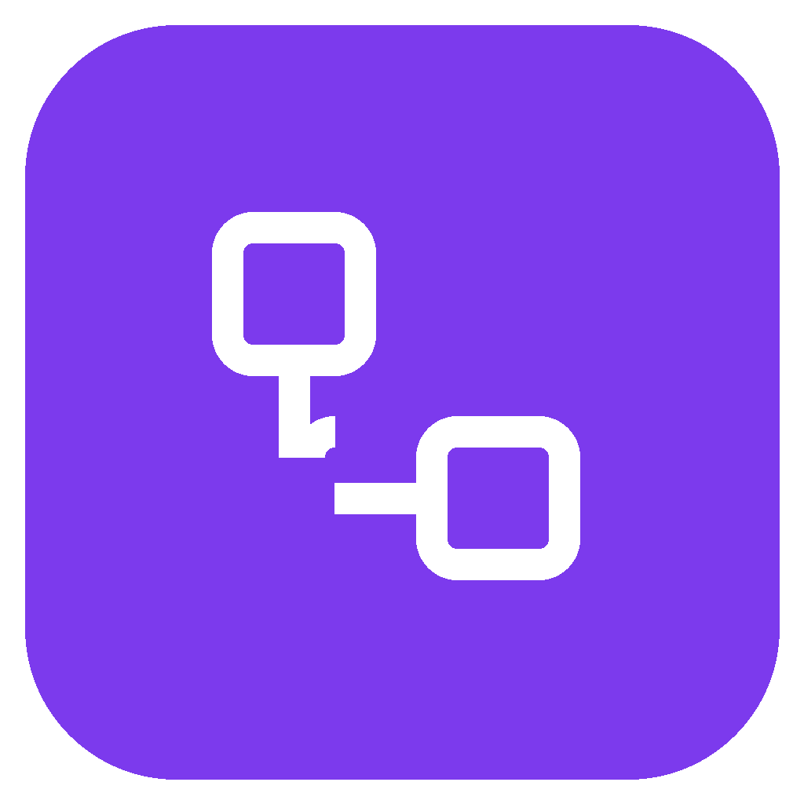
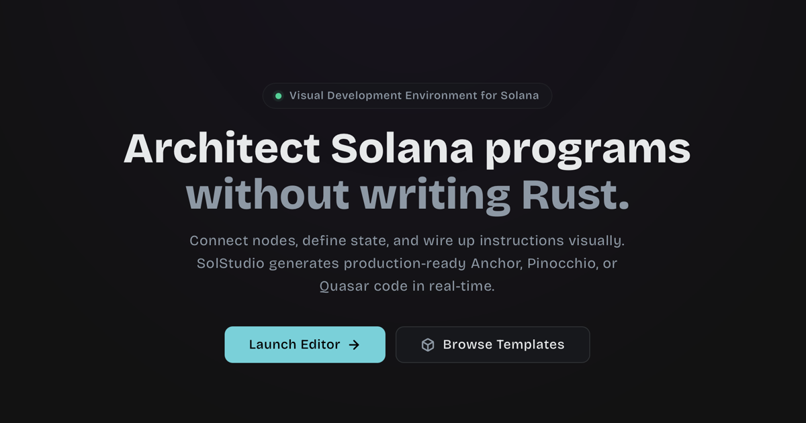
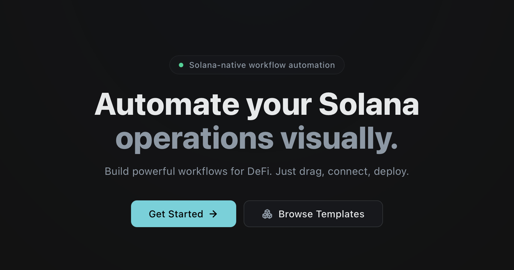
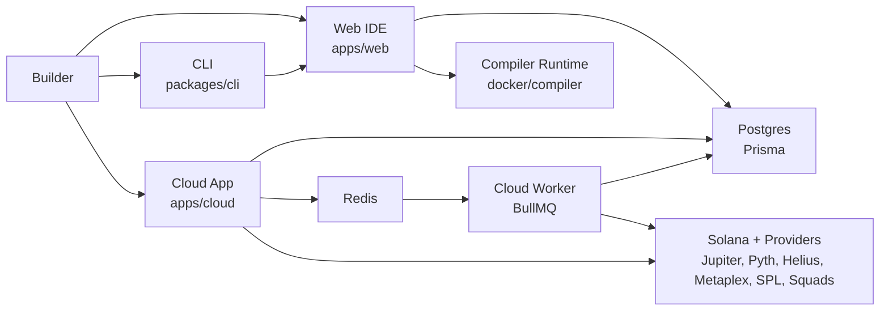

<p align="center">
  
</p>

<h1 align="center">SolStudio</h1>

<p align="center">
  Visual Solana program builder, CLI project visualizer, and Cloud workflow automation platform.
</p>

<p align="center">
  <a href="https://solstudio.fun">Web IDE</a>
  |
  <a href="https://cloud.solstudio.fun">Cloud</a>
  |
  <a href="./apps/web/src/app/docs">Docs</a>
  |
  <a href="./docs/PROJECT_INDEX.md">Project Index</a>
</p>

<p align="center">
  
  
</p>

## What SolStudio Does

SolStudio turns Solana development and automation into visual workflows.

The platform has three connected surfaces:

| Surface                  | Location                          | Purpose                                                                                                     |
| ------------------------ | --------------------------------- | ----------------------------------------------------------------------------------------------------------- |
| Web IDE                  | `apps/web`                        | Visual Solana builder for contracts, audits, code generation, templates, and deployment flows.              |
| SolStudio Cloud          | `apps/cloud`                      | Hosted workflow automation with triggers, protocol nodes, credentials, run logs, and replayable executions. |
| CLI and local visualizer | `packages/cli`, `apps/standalone` | Parse a local Solana project and inspect it as a visual graph from the terminal.                            |

SolStudio is built for builders who want a higher-level interface without losing the ability to inspect code, generated files, workflow state, credentials, and runtime output.

## Architecture



## Key Features

- Visual Solana contract and workflow editing with React Flow based graph surfaces.
- Cloud workflow builder with manual runs, triggers, credentials, run history, node outputs, and execution replay data.
- Protocol node system for Jupiter, Pyth, Helius, Metaplex, SPL Token, Squads, webhooks, delays, filters, notifications, and AI-assisted workflow steps.
- Marketplace and templates for reusable Web IDE projects and Cloud automation flows.
- Shared auth and database model across the SolStudio product surfaces.
- Encrypted Cloud credentials and wallet storage with secret redaction in logs.
- Local CLI that can parse a Solana codebase and open an interactive visualization.
- Docker production setup for the Web app, Cloud app, worker, compiler runtime, and Redis.

## Tech Stack

| Layer           | Stack                                                                      |
| --------------- | -------------------------------------------------------------------------- |
| Runtime         | Bun 1.3.10, Node-compatible TypeScript                                     |
| Frontend        | Next.js 15, React 19, Tailwind CSS, React Flow                             |
| Backend         | Next.js route handlers, Prisma, PostgreSQL                                 |
| Cloud execution | BullMQ, Redis, encrypted credentials, worker process                       |
| Solana tooling  | Anchor-aware templates, SPL Token helpers, provider API nodes              |
| Auth            | NextAuth with OAuth providers                                              |
| Deployment      | Docker Compose, standalone Next.js output, reverse-proxy friendly services |

## Repository Map

```text
.
+-- apps
|   +-- web                 # Main SolStudio IDE and public docs
|   +-- cloud               # SolStudio Cloud dashboard, editor, API, worker
|   +-- standalone          # Local visualizer shell used by the CLI flow
|   +-- docs                # Docs-specific app surface
+-- packages
|   +-- cli                 # solstudio CLI
|   +-- cloud-nodes         # Cloud node registry, schemas, executors
|   +-- codegen             # Code generation helpers
|   +-- db                  # Prisma schema, client, migrations, seed scripts
|   +-- flow-nodes          # Visual builder node definitions
|   +-- rust-parser         # Rust and Anchor project parsing
|   +-- auth                # Shared authentication helpers
|   +-- cloud-engine        # Cloud workflow execution engine
|   +-- cloud-wallet        # Cloud wallet and credential helpers
|   +-- ui                  # Shared UI primitives
+-- docs                    # Architecture, deployment, security, and product notes
+-- docker/compiler         # Persistent Solana/Anchor compiler runtime image
+-- prisma                  # Root Prisma entrypoints where applicable
+-- public                  # Shared brand assets
+-- docker-compose.yml      # Production-style multi-service stack
```

## Local Development

### Prerequisites

- Bun `1.3.10` or newer
- PostgreSQL
- Redis, required for Cloud workflow queues
- Docker, optional for production-style local runs

### Install

```bash
bun install
cp .env.example .env
bun run db:generate
bun run db:seed:all
```

Update `.env` with your local database URL, auth secret, OAuth credentials, and optional provider keys.

### Run the Web IDE

```bash
bun run --cwd apps/web dev
```

Open `http://localhost:3000`.

### Run SolStudio Cloud

```bash
bun run --cwd apps/cloud dev
```

Open `http://localhost:3001`.

Cloud workflow execution needs Redis and the Cloud worker path. For a quick Redis instance:

```bash
docker run --name solstudio-redis -p 6379:6379 redis:7-alpine
```

### Run the CLI Visualizer

```bash
bun run --cwd packages/cli build
bun run --cwd packages/cli solstudio view ./path-to-solana-project
```

## Environment Variables

Start from `.env.example` for local development and `.env.production.example` for production.

| Variable                     | Required               | Purpose                                                        |
| ---------------------------- | ---------------------- | -------------------------------------------------------------- |
| `DATABASE_URL`               | Yes                    | PostgreSQL connection string for Prisma.                       |
| `AUTH_SECRET`                | Yes                    | NextAuth signing secret.                                       |
| `AUTH_URL`                   | Yes                    | Canonical auth URL for the active app.                         |
| `ENCRYPTION_MASTER_KEY`      | Yes for Cloud          | 32-byte hex key used to encrypt Cloud credentials and wallets. |
| `REDIS_URL`                  | Yes for Cloud runs     | Redis connection used by BullMQ queues.                        |
| `NEXT_PUBLIC_SOLANA_RPC_URL` | Recommended            | Default Solana RPC endpoint shown to clients.                  |
| `NEXT_PUBLIC_SOLANA_NETWORK` | Recommended            | Network label, for example `devnet` or `mainnet-beta`.         |
| `COMPILER_SERVICE_URL`       | Web compile flows      | Optional remote compiler URL when that path is configured.     |
| `AUTH_COOKIE_DOMAIN`         | Production shared auth | Parent cookie domain such as `.solstudio.fun`.                 |
| `NEXT_PUBLIC_APP_URL`        | Production             | Public Web IDE URL.                                            |
| `NEXT_PUBLIC_CLOUD_URL`      | Production             | Public Cloud URL.                                              |
| `NEXT_PUBLIC_WEB_URL`        | Production             | Public Web IDE URL used by Cloud links.                        |

Optional provider keys:

| Variable                             | Provider                                     |
| ------------------------------------ | -------------------------------------------- |
| `JUPITER_API_KEY`                    | Jupiter authenticated endpoints.             |
| `JUPITER_API_BASE`                   | Override Jupiter base URL when needed.       |
| `BIRDEYE_API_KEY`                    | Birdeye market data nodes.                   |
| `HELIUS_API_KEY`                     | Helius RPC, webhook, and account data nodes. |
| `OPENAI_API_KEY`                     | OpenAI-backed AI nodes.                      |
| `ANTHROPIC_API_KEY`                  | Anthropic-backed AI nodes.                   |
| `GEMINI_API_KEY` or `GOOGLE_API_KEY` | Gemini-backed AI nodes.                      |

Do not commit `.env`, provider API keys, wallet keys, cookies, or production secrets.

## Production Deployment

The production stack is Docker Compose based. It builds separate images for the Web app and Cloud app, then runs the Cloud worker from the Cloud image.

```bash
cp .env.production.example .env.production
docker compose build app cloud
docker compose up -d --no-build --force-recreate app cloud cloud-worker
docker compose run --rm --no-deps -w /app app bun run db:cloud-seed
```

Useful health checks:

```bash
curl http://localhost:3000
curl http://localhost:3001/api/health
curl https://cloud.solstudio.fun/api/health
```

After a successful rebuild, Docker cache can be cleaned with:

```bash
docker builder prune -af
docker image prune -f
```

## Verification

Run focused checks before pushing production changes:

```bash
bun run --cwd packages/cloud-nodes test
bun run --cwd apps/cloud test
bun run --cwd apps/cloud typecheck
bun run --cwd apps/web typecheck
bun run --cwd apps/cloud build
bun run --cwd apps/web build
git diff --check
```

For full monorepo validation:

```bash
bun run build
bun run test
```

## Cloud Workflow Model

SolStudio Cloud workflows are node graphs. A workflow can be run manually or triggered by configured trigger nodes. Each run records node status, inputs, outputs, timings, warnings, and errors so the UI can show what happened during execution.

Typical workflow examples:

- Watch a wallet and send an alert when a token account changes.
- Check a Jupiter quote and route a swap decision through a risk filter.
- Pull token or NFT metadata and enrich it with a notification step.
- Run a treasury approval flow before a transaction is prepared.
- Trigger a webhook, transform the payload, and call a Solana provider.

## Security Notes

- Cloud credentials and wallet secrets are encrypted at rest.
- Secrets are redacted from logs and execution payloads.
- Provider API keys should be stored in environment variables or user credentials, never in source code.
- Webhook and run APIs should use replay protection and scoped tokens in production.
- Production auth should use the parent cookie domain only when both Web and Cloud are intended to share the same account session.

See [docs/CLOUD_SECURITY_RUNBOOK.md](./docs/CLOUD_SECURITY_RUNBOOK.md) for operational checks.

## Documentation

- [Project index](./docs/PROJECT_INDEX.md)
- [Product architecture](./docs/PRODUCT_ARCHITECTURE.md)
- [Cloud security runbook](./docs/CLOUD_SECURITY_RUNBOOK.md)
- [Cloud docs source](./apps/web/src/app/docs/cloud.md)
- [Web docs source](./apps/web/src/app/docs)

## Brand Assets

| Asset                    | Path                                           |
| ------------------------ | ---------------------------------------------- |
| Primary logo PNG         | `public/solstudio-logo.png`                    |
| Primary logo SVG         | `public/solstudio-logo.svg`                    |
| Web IDE Open Graph image | `apps/web/public/og.png`                       |
| Cloud Open Graph image   | `apps/cloud/public/cloud-og.png`               |
| Web app logo copy        | `apps/web/public/solstudio-logo-primary.png`   |
| Cloud app logo copy      | `apps/cloud/public/solstudio-logo-primary.png` |

## License

This repository currently does not declare a public license. Treat it as proprietary unless a license file is added.
